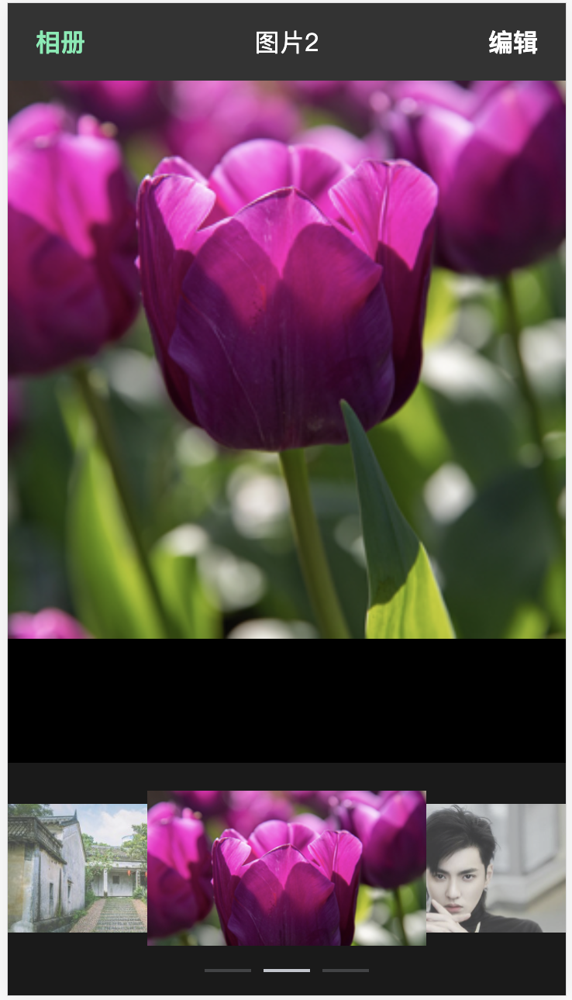
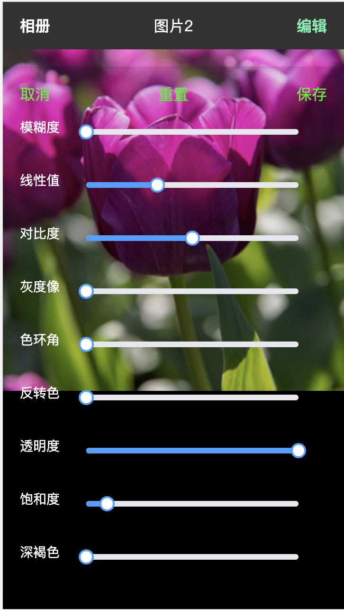
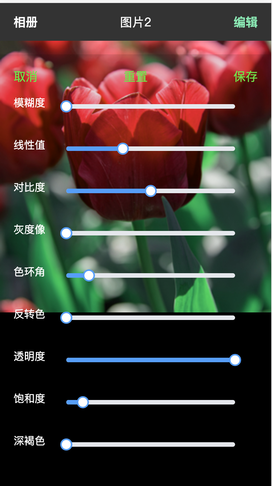
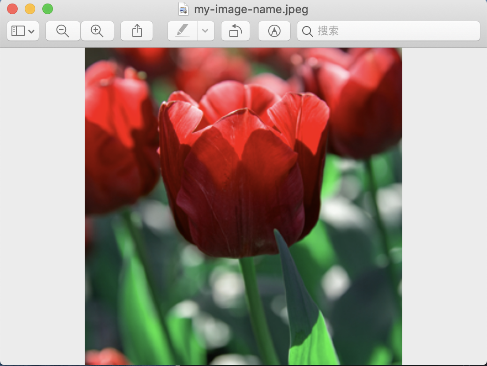

# test-vue2

## Project setup
```
npm install
```

### Compiles and hot-reloads for development
```
npm run serve
```

### Compiles and minifies for production
```
npm run build
```

### Customize configuration
See [Configuration Reference](https://cli.vuejs.org/config/).

## 使用效果图
### 相册


### 编辑页面


### 美化时


### 保存美图后图片到本地

